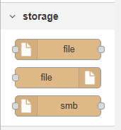
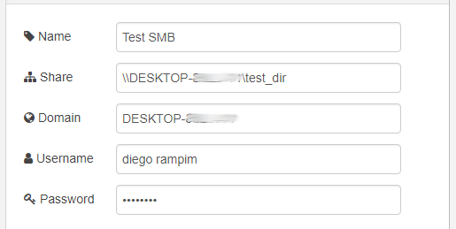
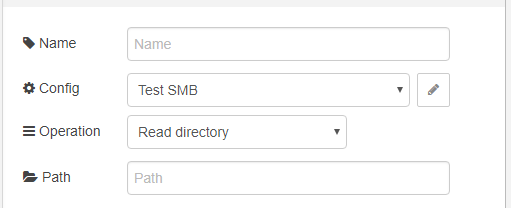

# node-red-contrib-smb
Node of Node-RED for SMB Protocol and was developed by [Smart-Tech](https://netsmarttech.com) to run on [ST-One](https://netsmarttech.com/page/st-one).

## Library

This node is based on [@tracker1/smb2](https://github.com/netsmarttech/node-smb2.git).

## How to install?

To install the stable version use the `Menu - Manage palette` option and search for `node-red-contrib-open-protocol`, or run the following command in your Node-RED user directory (typically `~/.node-red`):

    npm install node-red-contrib-smb

## How to use?

This node stay on tab `storage`



### Config

Start by adding a new SMB configuration



- `Share`: define the path sharing.
- `Domain`: define the domain for authentication.
- `Username`: define the username for authentication.
- `Password`: define the password for authentication.

### Node



- `Config`: the path to operate on.
- `Operation`: define operation for this node.
    - `Read directory`: this operation return an array of file object. If not set `Path` in node properties, then `msg.filename` is used as Path.
    - `Read file`: this operation return a string with content of file. If not set `Path` in node properties, then `msg.filename` is used as Path.
    - `Remove file`: this operation remove file. If not set `Path` in node properties, then `msg.filename` is used as Path.
    - `Rename/Move file`: this operation move or rename file. If not set `Path` or `New path` in node properties, then `msg.filename` is used as Path and `msg.new_filename` is used as New Path.
    - `Create file`: this operation create new file. If not set `Path` in node properties, then `msg.filename` is used as Path and `msg.payload` is content of file.
    - `MKDIR`: this operation create new directory. If not set `Path` in node properties, then `msg.filename` is used as Path for new directory.
    - `RMDIR`: this operation remove directory. If not set `Path` in node properties, then `msg.filename` is used as Path for remove directory.
    - `Exists`: this operation test if exist a file. If not set `Path` in node properties, then `msg.filename` is used as Path for test. Output: `msg.exists`.
    - `Ensure dir`: this operation tests if the directory exist, if not, this operation will create it. If not set `Path` in node properties, then `msg.filename` is used as Path.
    
 ### Example
   
 ```json
[{"id":"d98a0bed.d5ed78","type":"SMB","z":"6fd21037.f7a6e","name":"","config":"d54bf2c9.b6a68","operation":"ensure-dir","path":"","path_new":"","x":520,"y":300,"wires":[["b69cbaf3.825948","19c05821.2a8128"]]},{"id":"bb6567.0aedea98","type":"inject","z":"6fd21037.f7a6e","name":"Start process","topic":"","payload":"","payloadType":"str","repeat":"","crontab":"","once":false,"onceDelay":0.1,"x":130,"y":100,"wires":[["57ddfa59.0db474"]]},{"id":"b69cbaf3.825948","type":"debug","z":"6fd21037.f7a6e","name":"Ensure Dir","active":true,"tosidebar":true,"console":false,"tostatus":false,"complete":"true","x":750,"y":300,"wires":[]},{"id":"14b00717.a0a4b9","type":"change","z":"6fd21037.f7a6e","name":"","rules":[{"t":"set","p":"filename","pt":"msg","to":"example","tot":"str"}],"action":"","property":"","from":"","to":"","reg":false,"x":290,"y":300,"wires":[["d98a0bed.d5ed78"]]},{"id":"d9c4521b.03cbf","type":"comment","z":"6fd21037.f7a6e","name":"Create dir example","info":"","x":290,"y":260,"wires":[]},{"id":"b898097b.5ba4f8","type":"change","z":"6fd21037.f7a6e","name":"","rules":[{"t":"set","p":"payload","pt":"msg","to":"Text of File","tot":"str"},{"t":"set","p":"filename","pt":"msg","to":"file_example.txt","tot":"str"}],"action":"","property":"","from":"","to":"","reg":false,"x":280,"y":500,"wires":[["81b461aa.2259a"]]},{"id":"81b461aa.2259a","type":"SMB","z":"6fd21037.f7a6e","name":"","config":"d54bf2c9.b6a68","operation":"create","path":"","path_new":"","x":510,"y":500,"wires":[["bff9f131.71aba","3d679b98.7e1544"]]},{"id":"57ddfa59.0db474","type":"SMB","z":"6fd21037.f7a6e","name":"","config":"d54bf2c9.b6a68","operation":"read-dir","path":"","path_new":"","x":300,"y":200,"wires":[["f13b4800.28dc28","14b00717.a0a4b9"]]},{"id":"f13b4800.28dc28","type":"debug","z":"6fd21037.f7a6e","name":"Read dir /test_dir","active":true,"tosidebar":true,"console":false,"tostatus":false,"complete":"true","x":770,"y":200,"wires":[]},{"id":"95cd12c7.e9114","type":"comment","z":"6fd21037.f7a6e","name":"Read dir /test_dir","info":"","x":280,"y":160,"wires":[]},{"id":"19c05821.2a8128","type":"SMB","z":"6fd21037.f7a6e","name":"","config":"d54bf2c9.b6a68","operation":"read-dir","path":"","path_new":"","x":300,"y":400,"wires":[["299ca16d.57330e","b898097b.5ba4f8"]]},{"id":"299ca16d.57330e","type":"debug","z":"6fd21037.f7a6e","name":"Read dir /test_dir","active":true,"tosidebar":true,"console":false,"tostatus":false,"complete":"true","x":770,"y":400,"wires":[]},{"id":"4fa9bd8a.ac3934","type":"comment","z":"6fd21037.f7a6e","name":"Read dir /test_dir","info":"","x":280,"y":360,"wires":[]},{"id":"ea69f995.a70cb8","type":"comment","z":"6fd21037.f7a6e","name":"Create file on /test_dir","info":"","x":300,"y":460,"wires":[]},{"id":"bff9f131.71aba","type":"debug","z":"6fd21037.f7a6e","name":"Create file on /test_dir","active":true,"tosidebar":true,"console":false,"tostatus":false,"complete":"true","x":780,"y":500,"wires":[]},{"id":"3d679b98.7e1544","type":"change","z":"6fd21037.f7a6e","name":"","rules":[{"t":"set","p":"filename","pt":"msg","to":"file_example.txt","tot":"str"},{"t":"set","p":"new_filename","pt":"msg","to":"example/file_example.txt","tot":"str"}],"action":"","property":"","from":"","to":"","reg":false,"x":280,"y":600,"wires":[["1a1b1f3e.eb5251"]]},{"id":"1a1b1f3e.eb5251","type":"SMB","z":"6fd21037.f7a6e","name":"","config":"d54bf2c9.b6a68","operation":"rename","path":"","path_new":"","x":530,"y":600,"wires":[["5bd9dce6.014ac4","a3fb39c9.c53e18"]]},{"id":"fd679b3f.e79ab8","type":"comment","z":"6fd21037.f7a6e","name":"Move file of /test_dir to /test_dir/example","info":"","x":360,"y":560,"wires":[]},{"id":"5bd9dce6.014ac4","type":"debug","z":"6fd21037.f7a6e","name":"Create file on /test_dir","active":true,"tosidebar":true,"console":false,"tostatus":false,"complete":"true","x":780,"y":600,"wires":[]},{"id":"a3fb39c9.c53e18","type":"SMB","z":"6fd21037.f7a6e","name":"","config":"d54bf2c9.b6a68","operation":"read-dir","path":"example","path_new":"","x":300,"y":700,"wires":[["f2d9e287.cb8c5","1922084a.ec3f88"]]},{"id":"f2d9e287.cb8c5","type":"debug","z":"6fd21037.f7a6e","name":"Read dir /test_dir/example","active":true,"tosidebar":true,"console":false,"tostatus":false,"complete":"true","x":790,"y":700,"wires":[]},{"id":"cff2f109.66825","type":"comment","z":"6fd21037.f7a6e","name":"Read dir /test_dir/example","info":"","x":310,"y":660,"wires":[]},{"id":"1922084a.ec3f88","type":"SMB","z":"6fd21037.f7a6e","name":"","config":"d54bf2c9.b6a68","operation":"read-file","path":"example/file_example.txt","path_new":"","x":300,"y":800,"wires":[["84549664.fd5478"]]},{"id":"84549664.fd5478","type":"debug","z":"6fd21037.f7a6e","name":"Read file /test_dir/example/file_example.txt","active":true,"tosidebar":true,"console":false,"tostatus":false,"complete":"true","x":850,"y":800,"wires":[]},{"id":"b9261964.63ead8","type":"comment","z":"6fd21037.f7a6e","name":"Read file /test_dir/example/file_example.txt","info":"","x":360,"y":760,"wires":[]},{"id":"d54bf2c9.b6a68","type":"smb config","z":"","name":"Test SMB","share":"\\\\127.0.0.1\\test_dir","domain":"DESKTOP-8LL41V1"}]
```
    
    
## License

Copyright 2018 Smart-Tech, [Apache 2.0 license](LICENSE).